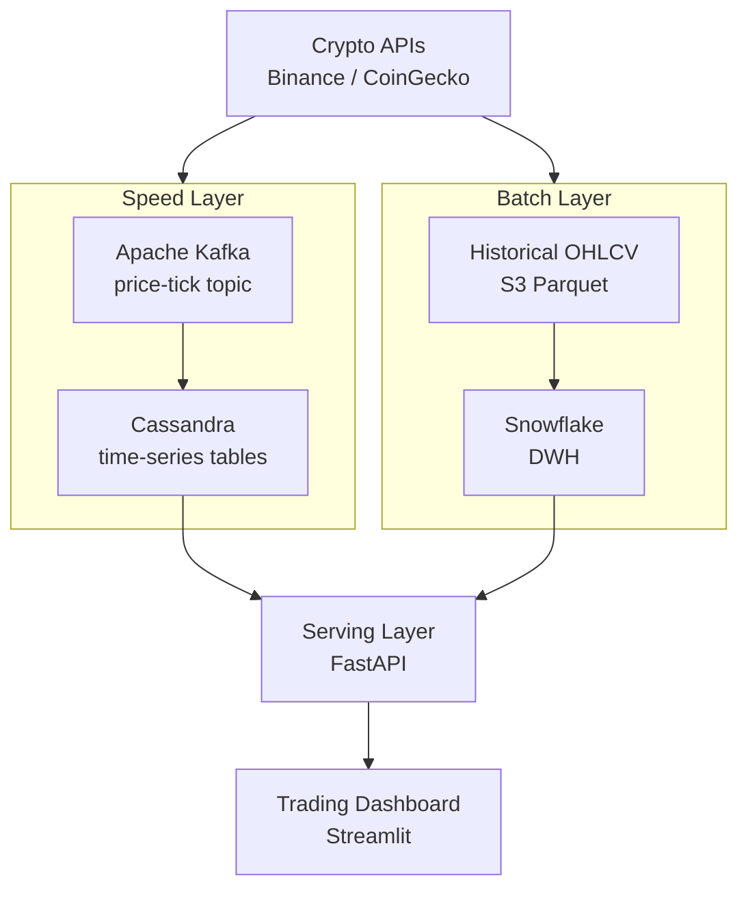

# Crypto Lambda Architecture — Kafka + Cassandra + Snowflake


Lambda Architecture implementation for cryptocurrency market data, combining a real-time **speed layer** (Kafka → Cassandra) for live price feeds and a **batch layer** (historical loads → Snowflake) for deep analytics. Merges both layers into a serving layer for unified queries.

## Architecture



## Features

- Real-time crypto tick data ingestion from Binance WebSocket
- Cassandra wide-column model optimized for time-series queries
- Snowflake batch layer with OHLCV candlestick aggregations
- Lambda merge layer: recent data from Cassandra, historical from Snowflake
- Support for 50+ trading pairs (BTC, ETH, BNB, etc.)
- REST API for querying price history at any granularity

## Tech Stack

| Layer | Technology |
|-------|-----------|
| Speed Ingestion | Kafka + Binance WS |
| Speed Store | Apache Cassandra |
| Batch Store | Snowflake |
| Serving API | FastAPI |
| Visualization | Streamlit |
| Infrastructure | Docker Compose |

## Prerequisites

- Docker & Docker Compose
- Python 3.10+
- Snowflake account
- (Optional) Binance API key for authenticated endpoints

## Quick Start

```bash
git clone https://github.com/zulham-tech/crypto-lambda-kafka-cassandra-snowflake.git
cd crypto-lambda-kafka-cassandra-snowflake
cp .env.example .env
docker compose up -d
python speed_layer/producer.py --pairs BTC/USDT ETH/USDT
```

## Project Structure

```
.
├── speed_layer/         # Kafka producer + Cassandra consumer
├── batch_layer/         # Historical loader to Snowflake
├── serving_layer/       # FastAPI merge & query API
├── dashboard/           # Streamlit price visualization
├── cassandra/           # CQL schema definitions
├── snowflake/           # DDL + dbt models
├── docker-compose.yml
└── requirements.txt
```

## Author

**Ahmad Zulham** — [LinkedIn](https://linkedin.com/in/ahmad-zulham-665170279) | [GitHub](https://github.com/zulham-tech)
